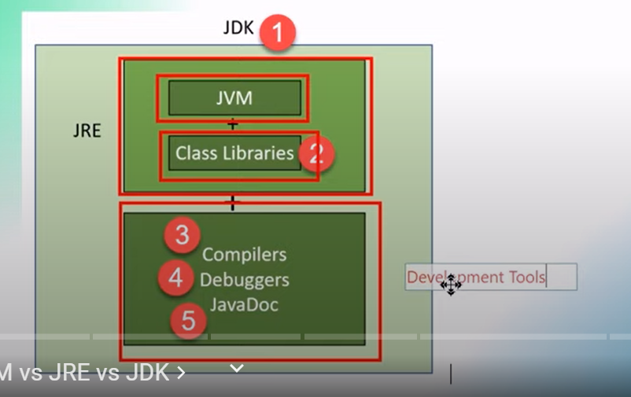

// introduction to java programming
// java virtual machine 
// java setup
// java first program'
// variables in java 
// java data types;
// type casting in java
// java operators 
// if else
// switch conditionnal
// loop
<!-- jvm jre jdk -->
java virtual machine 
